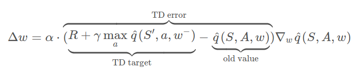
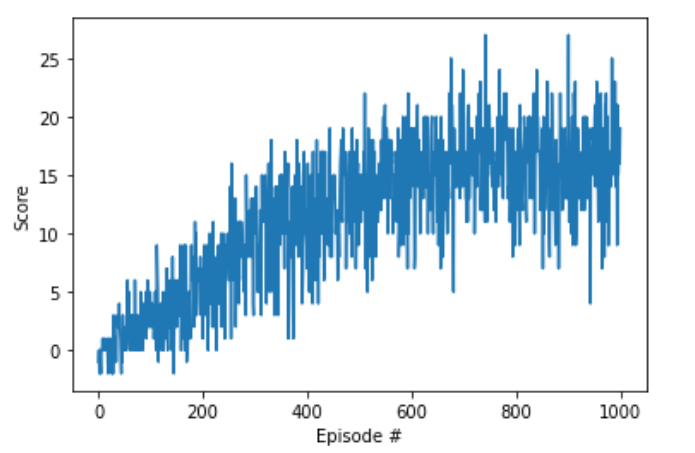
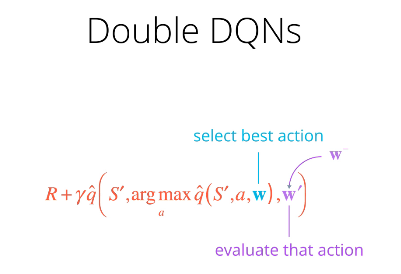
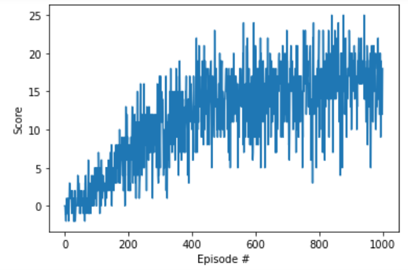

### Model Architecture
The fundemental update rule in deep Q learning is as follows

The important issue here is that the target model is called target in the code.
This model is not updated often. 
In this case q is a Neural Net that takes as input the state of an agent and returns
the expected discounted reward for each possible actions. For example in this project
there are 4 actions possible, so the output of the Neural Net is a [1x4] vector with real
values corresponding to long term reward for each of the actions taken at that state.   
```buildoutcfg
self.qnetwork_local = QNetwork(state_size, action_size, seed).to(device)
```
In the image above you can see what is annotated as the old value. 
The old value is extracted from a Neural net model as well.
This model in the code is referred to by the the local model.
This is the model that in its Vanila version used for identifying the 
next action to make, at the current state at time `t` . 
```buildoutcfg
action_values = self.qnetwork_local(state)
np.argmax(action_values.cpu().data.numpy())
```
in the vanilla code the target model and the local model are both updated at the same time,
.The update is carried out after receiving a random batch of experiences.
The size of this is sample the batch size and each sample is made of (S,A,R,S',done)
However, they are not update in the same way. The local model is updated with back-propagation.
The target model is  updated softly (weighted average):
```buildoutcfg
θ_target = τ*θ_local + (1 - τ)*θ_target
where τ = 0.001
```
So the target model parameters is update less frequently and lags behind the local model. 
The lecture stated this gives the optimization more stability. 
Finally, the target model in deep q learning is used to select the best action in state `t+1`
#### Hyper-parameters 
i used the same parameters used in the DQN exercise, and was able to achieve a score of 16.
#### implementation 
* step 1: follow the instructions below to setup the environment on your own computer
```buildoutcfg
    conda create python=3.6 -n unity
    conda activate unity
    conda install numpy
    pip install unityagents
    pip install mlagents
```
* step 2: use the following scripts to execute the results
```buildoutcfg
    Navigation.ipynb
```
* step 3: run the cells up to cell starting with
```buildoutcfg
def dqn(n_episodes=1000, max_t=1000, eps_start=1.0, eps_end=0.01, eps_decay=0.995):
```
#### Performance
The model is stored as `checkpoint.pth`. 
the performance results can be seen below, which achieves score of 13 in about 400 episodes.

### Double DQN
I implemented the double DQN based on the lecture video.
This improvement was the simplest among the 3 proposed improvements.

note to myself: to implement the importance sampling improvement,
you can add the penalty to the penalty as another parameter along with 
states, actions, rewards, next_states, dones, penalty = experiences
then you can just adjust the update according the penality. 
#### implementation  
* step 1: use the following scripts to execute the results
```buildoutcfg
    Navigation.ipynb
the new script are used to run this improvements
    dqn_agent_double.py
```
* step 2: run the cells up to cell starting with
```buildoutcfg
def dqn_double(n_episodes=1000, max_t=1000, eps_start=1.0, eps_end=0.01, eps_decay=0.995):
```
#### Performance

### Pixel-based DQN
i used a vanilla 2 CNN layer with 3 fully connected layer,
which i found on a pytorch classification tutorial for accomplish this implementation. 
since the environment is very simple and dark and yellow bananas are quite distinct,
i convert the original image into gray scale image. 
That is i go from a state of size (1, 3, 84, 84) to (1, 1, 84, 84)
the model can be found here
```buildoutcfg
    model_pixel.py
```
despite trying different configurations the model does not converge.
the files used for this implementation as as follows
```buildoutcfg
    Navigation_Pixels.ipynb
    checkpoint_pixel.pth  #stored model
    dqn_agent_double_pixel.py
    model_pixel.py
```
**The model does not converge and the average reward remains around 0. 
which i believe indicates random action. 
i would appreciate any hint to make this model converge**
