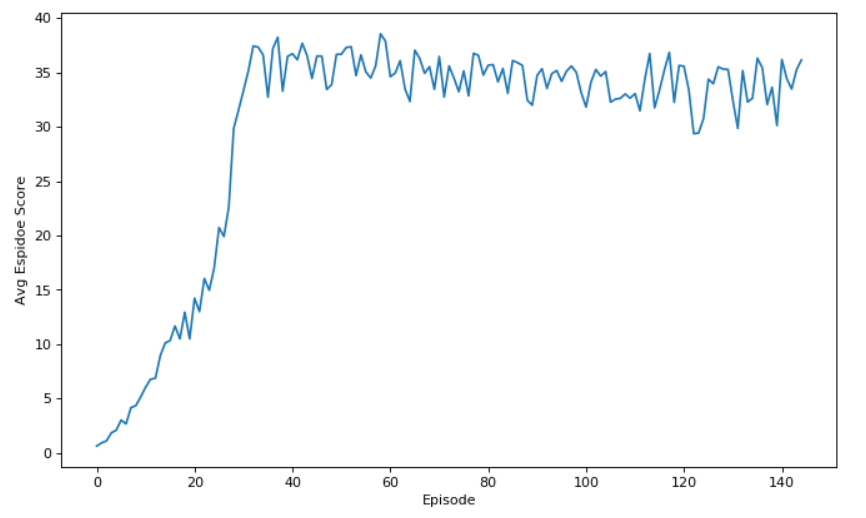
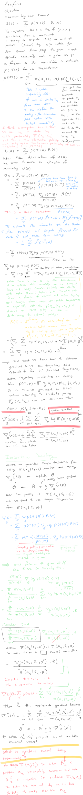
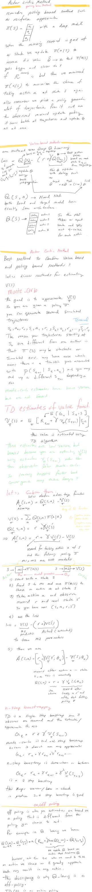

## Project Summary:
### Conda Environment Setup
to run this project you need to set up your conda environment as follows.  
```buildoutcfg
    conda create python=3.6 -n unity
    conda activate unity
    conda install numpy, pytorch
    pip install unityagents
    pip install mlagents
```
the baseline code used for this project was borrowed from ddpg-pendulum directory in this repo.
The following changes were applied to the code

### Unity Environment and Project Objective:
Number of agents: 1 if `./Reacher_Linux/Reacher.x86_64` is used or 20 if `./Reacher_Linux_multi/Reacher.x86_64` is used 
Size of each action is 4. Every entry in the action vector should be a number between -1 and 1.
Each action is a vector with four numbers, corresponding to torque applicable to two joints. 
Each agent observes a state with length 33 corresponding to position, rotation, velocity, and angular velocities of the arm. 
The task is episodic, and in order to solve the environment,
the agent must get an average score of +30 over 100 consecutive episodes.

In this environment, a double-jointed arm can move to target locations. 
A reward of +0.1 is provided for each step that the agent's hand is in the goal location. 
Thus, the goal of your agent is to maintain its position at the target location for as 
many time steps as possible

### Code Structure
* Continous_Control.ipynb: 
contains the code to implement this project:
   * Random robot arms to get familiar with the Unity environment
   * Running the simulation to training the critic-actor models 
   * Observing how the model does for a single arm
Currently, there is a known issue that i cannot run the code end to end. 
Essentially the bug is that i cannot run this:
```
from unityagents import UnityEnvironment

env = UnityEnvironment(file_name='./Reacher_Linux_multi/Reacher.x86_64')
env.close()

env = UnityEnvironment(file_name='./Reacher_Linux_multi/Reacher.x86_64')
```
results in an exception. This prevents me from training and testing within one jupyter notebook.

* robot_agent.py:
contains the class Agent which is responsible for interacting with the unity environment to 
collect experiments and contains the loss functions for actor-critic model.
The code also contains class for random sampling from experiments, and generating random noise for 
actions. This random noise added to actions is essentially similar to epsilon greedy in which 
we act in a sub-optimal way to collect more information. In the final implementation the noise 
variance is reduced with more iterations. 

* model.py:
contains the actor and critic models. The model structure is fairly simple except for one interesting piece:
```
    def forward(self, state, action):
        """Build a critic (value) network that maps (state, action) pairs -> Q-values."""
        xs = F.relu(self.batch_norm_fcs1(self.fcs1(state)))
        x = torch.cat((xs, action), dim=1)
``` 
here we are estimating Q(A, S) in a peculiar way, by passing the state first into a FC layer, 
then concatenating the output with action. This as oppose to concatenating action and state and then
feeding the resulting tensor to a FC layer. My intuition is that this approach allows the model 
to capture the interaction between A, S easier. 

* Unity environments:
Udacity has built 2 environments one with 1 agent and the other with 20 agents. Place the folder in the 
p2_continous-control folder. 

### Code Changes Implemented
I essentially used the DDPG implementation along with the recommendation from the udacity. 
The key features of my implementation are as follows:
1) using the 20 agent implementation of unity instead of 1 agent. 
this allows me to collect 20 times more experiment in the same amount of time.

2) I unwrap the 20 experiments inside the step function and add them one by one to the replay buffer

3) after each action and collected reward and adding 20 new data points to the replay buffer,
i run the training `n` number of times. One line of code, the for loop, was taken from another udacity student because i
did not quite understood what the instruction means by "update the networks 10 times after every 20 timesteps".
I suggest the authors change the wording to clarify that 20 time steps is actually one round of simulation
in the 20 agent simulation run.
    ```
    for _ in range(15):
        experiences = self.memory.sample()
    ```
4) I tried with initial random action because i felt the actor model will have some initial bias.
    the initial bias might prevent the actor from axploring some actions:
    ```
    def act(self, state, add_noise=True, random_action=False):
        """Returns actions for given state as per current policy."""
        if random_action and len(self.memory) < 2*int(1e4):
            action = np.random.randn(self.number_of_agents, self.action_size)
    ```
    however trying this strategy did not help improve the performance, so i turned it off. 

5) gradient clipping was uses as suggested by Udacity:
    ```
        # Minimize the loss
        self.critic_optimizer.zero_grad()
        critic_loss.backward()
        torch.nn.utils.clip_grad_norm(self.critic_local.parameters(), 1)
        self.critic_optimizer.step()
    ```
6) the noisy action function was adjusted to inject independent noise for each agent:
    ```
        if add_noise:
            noise = np.array([self.noise.sample() for _ in range(self.number_of_agents)])
            action += noise
    ```

7) Learning algorithm is Adams optimization. 
    For more details about the algorithm see my notes in later sections. The general idea is 
    that we train two models: (1) actor: estimates the arg-max Q(S,a) and
    (2) Critic: estimares the Q(S, a). Both models have a local and target model.
    the local model is trained using Adams optimization, while the target model parameters 
    lags behind the local model and evolves more slowly. Some of the hyper-paramaters are as follows
    ```
        BUFFER_SIZE = int(1e5)  # the maximum size of (S, A, R, S', Done) experience tuples that we hold into memory
        BATCH_SIZE = 128  # training batch size
        TAU = 1e-3  # for soft update of target parameters
        LR_ACTOR = 1e-4  # learning rate of the actor model
        LR_CRITIC = 1e-3  # learning rate of the critic model
        NOISE_DECAY_MULTIPLIER = 0.9999 # reducing the random action noise by this factor in each iteration
    ```
    I could not answer this question about the local and target model:
    in Q-learning, the correct loss requires knowing the true values of the q(S, A) function
    (shown in red).Obviously, the true q(S, A) is not available. 
    We replace the true q(S, A) with R + gamma*q_hat(S', a, w) in which q_hat is a
    target model (red) whose parameters are updated with some delay compared with the local
    q_hat model (blue). I do not understand how a model whose parameters is not updated
    by the data can be used as a surrogate for the true q(S,A). 
    the local (not the target) model whose parameters is updated frequently should
    be on average closer to the true q(S, A) than the target model. 
    On the other hand, i see that the target model has access to the observed 
    reward R, which is a data point the local model does not have access to. 
    By backpropagating the parameters of the local (blue) q function we are essentially 
    encouraging it to get closer to the target (red) q function, 
    which is updated less often and is out of date. Does not make sense to me. 

### Performance
it was very difficult to get the performance improve over time. The biggest problem was that my average score gets stuck and would not improve within the first 20
episodes and won't improve. Here are some of the things i tried:
1) batch normalization was added according to the student discussion here: https://knowledge.udacity.com/questions/58977 and noticed improvement
2) noise was decayed according to https://knowledge.udacity.com/questions/58977
3) reduced the actor critic model size according to https://knowledge.udacity.com/questions/167218, but performance did not improve
4) drop out was added for larger size models but model improved at a lower pace than before


I needed 107 episodes to get to score of 30.14. 

### Concepts and Learnings:
#### What is Replay Buffer 
notice throughout this whole training we keep on accumulating 100,000 experience tuples 
is the limit of how many experiences we collect before stating to throw away the earlier ones
notice that state, action, reward, next_state, done , for a deterministic simulator
is not at all a function of policy or Q. policy, actor, critic may impact how frequently
we perform an action but once the action is performed the next state and reward is derived from the
simulation. For example for a deterministic simulation if we are in state S , take action A, we will
end up in state S' , and this is independent of the models we are training.
so this means the experiences we are collecting better cover a large range of actions and states
so we can learn from them. This is why we play freely and then we learn, and we use epsilon greedy to try
random things so we get to collect reward and better estimate Q(S, A) for a wide combination of S, A
after several iterations, actor starts to reduce the number of random actions and we start acting
optimally according to actor function approximation.


#### Actor Loss function Explained 
we backpropagate the actor local model parameters only, excluding the critic model parameters
in a way to maximixe the Q(s, a) because we want the actor to always spit out argmax Q(s, a)
so we have this critical_local function that can calculate Q(s,a) and i want to train my actor
to output a value to Q(S, a) that will maximize its value for that state S.
while this propagation will impact all parameters of actor for a given state S,
the impact on critic is when actor spits out
an action which is fed into the Q that is in the direction of maximizing Q(s, action_from_actor)
also notice state S and output of the critic model is not part of optimization
when you do backproagate the actor in the optimization. The output of the critic Q(S, A) can
written as a function of the last layer parameteres of actor something like Q(S, A) = 10xWxS ,
in which W is an actor parameter, and S is the visited state and 10xWxS evaluated at current estimated
value of W is the critic output
, e.g., if w_hat = 2 then Q(S, A) = 10x2xS = 20S. Hopefully you can see from this example taking deravatives
with respect to actor parameter W to maximize the Q = 10W is straightforward. 
we could maximize the sum of Q(s, a) over all experiences or mean of Q(s, a) over all experiences

### Future Ideas:
1) Use image pixels as state representation rather than the 33 values provided in the course
and use CNNs instead of FC. The problem is that the environment is 3D. 
2) Exploring other actor-critic algorithms and materials in the class such as the ones introduced here: 
https://arxiv.org/abs/1604.06778,
https://arxiv.org/pdf/1803.07067.pdf,
https://ai.googleblog.com/2016/10/how-robots-can-acquire-new-skills-from.html
https://www.manning.com/books/grokking-deep-reinforcement-learning?a_aid=gdrl 'gdrludacity40' gives you a 40% off.


#### Personal Notes from the Lectures



