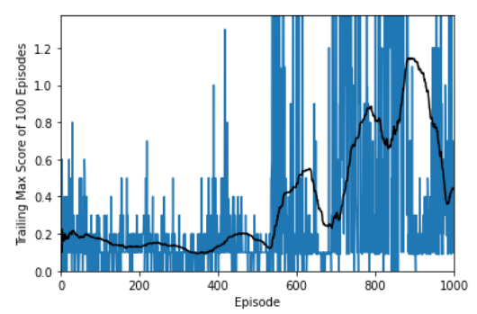
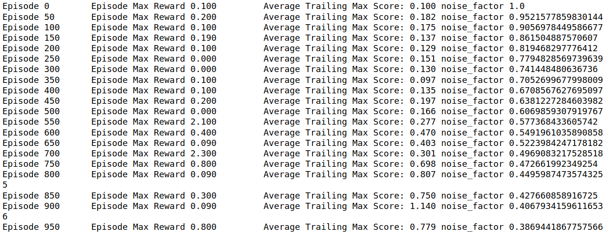

[//]: # (Image References)
[image1]: ./images/tennis.gif

## Deep Reinforcement Learning Lessons Learned 
This was the final and most challenging project in this course. Overall, after completing the assignments i feel it is very tricky to get the DRL to converge. I see a variety of limitations
such as the need for simulated environments to train the agents. For use-cases in which failure is 
very expensive such as self-driving cars, we do not have the luxury of simulations/failures. In temrs of convergence, even if we get the optimization to converge in one scenario, if the simulation is changed slightly, there is no guarantee that the optimization will be stable. 
I struggled quite a bit in getting the optimizations to work for this class where the action and state space was very small. I cannot imagine the algorithms will work in real world situations where we have myriad of actions and a huge and unpredictable state space. At this moment, i feel the DRL is limited to computer games. 

## Environment setup
to setup the environment refer to the instructions for setting up unity environment in project 2.

## Disclaimer
My code started from the MADDPG lecture code. Spent 1-2 weeks tweaking this to achieve the project goal. I never found any bugs in my code. I reviewed it line by line several times. After failing to achieve the goal with MADDPG, i reviewed a lot of materials from the class Forums.  

Many of the later tweaks were inspired by students who faced similar problems. In particular this two git repos posted by students helped me with some fine-tuning, which i have elaborated later 

https://github.com/gtg162y/DRLND/blob/master/P3_Collab_Compete/Tennis_Udacity_Workspace.ipynb
https://github.com/hoseasiu/DeepRLNanodegree/blob/master/MultiAgentProject

I also post my own questions in the forum as follows:
    https://knowledge.udacity.com/questions/409368
    https://knowledge.udacity.com/questions/399454
    

## Environment Details
Action is a 2 dimensional vector. The first element control the left and right movement and its speed. 
action of -1 pulls the agent to the edge of the table, action +1 moves the agent to the center. Values in between perform the same at a lower speed. Action of 0 does not move the agent. The second element of action control the jump. Any value below 0.5 will result in no motion in the agent. Action values above 0.5 will result in agent jumping up. So in fact this is simply a discrete action with value 0 and 1. Nonetheless we model it as a continuous action between -1 and 1. 

The instruction says. In this environment, two agents control rackets to bounce a ball over a net. If an agent hits the ball over the net, it receives a reward of +0.1. If an agent lets a ball hit the ground or hits the ball out of bounds, it receives a reward of -0.01. Thus, the goal of each agent is to keep the ball in play. Upon ball reaching the boundary of simulation a negative reward is assigned and episodes comes to a sudden end. 

Notice even if an agent hit the ball a couple of times on its side, it only receive a reward of 0.1 when the ball is sent to the other side of the table. So reward is not achieved by number of times the agent touches the ball. 

the state of each agent is a vector of 24 elements. There is no global environment provided like the MADDPG lecture, so i concatenated each agent states into a vector of length 48 and used that as the global state. 

## Features and Fine-Tunning

### Number of episodes
I varied it between 1500-2500 episodes. When running the fine tuning, i felt if i run the training for 5000+ episodes i could reach the required performance, but this was very slow, and i aimed at getting to eh 0.5 performance within 2500 episodes.

### Batch Sizes
I varied between 128 to 1280. Later on based on hints from the mentors i decided to go with batch size of 256. I did not notice a sizable difference in performance.

### Random actions before training
The initial 300 episodes are driven essentially by noise to collect reward from a variety of states. Without this the model learning is influences by the actor and critic initial values and this may lead
into not visiting a diverse set of states. While i tried this idea on my own in past projects in class, i should give credit to one of the class students who pointed this out in the forum with code. 

I also tried biasing the data collection as follows. If an episode max reward is larger than 0.1 i save it into buffer. Otherwise, i only save the scenario wit probability p. I did not spend a lot of time on this idea though.

### Number of training per episodes
I should change the name to number of episodes to number of steps within episode. Again, this was inspired by former students of class after spending 1 week on the assignment without success. The idea to run multiple training within each step of simulation, which improved performance. Overall, it seems more training helps the performance of the model whether it is done within an episode or by increasing the number of episodes.

### Buffer size
two buffer size of 100,000 and 1,000,000 was tried without much significant difference. 

### Noise dynamic
this was an area i spent a lot of time on
#### Default OUNoise
This noise did not give me good results. I tried variety of rates to decay the noise. I typically decay the noise with each step within an episode which was too fast with factors around 0.99995
#### Random Normal Distribution 
This noise also by itself did not help.
#### Random Normal Distribution with Controlled Decay
After Trying a lot of different decays within an episode, inspired by hints from other class students in forum, i started a more intelligent decay in which i do not decay the noise during the initial non-training period. Then i keep the noise decay fixed within one episode. Only decay happens when we go the the next episode. This allows smaller decay factor of 0.999.

### Training Frequency
This made a big difference in performance. Initially i followed the MADDPG process and updated the models after the end of each episode, but later on i brought the training inside the episode steps. In fact, I train 3 times for each step of training. That means if on average an episode takes 10 steps, and i run 1000 episodes, the total number of training is 10x1000x3 = 30,000. This definitely improved the performance. The problem is that as agents get better the length of episodes gets longer and there will be far more training. 

As shown the performance during episode 1250-1300 became so good that the episodes will run for the maximum length of around 1000 seconds. There was no point in waiting longer so i stopped the training after the agent scored an average of 0.7 points. 

The gif shows the performance of the agents during a game play. 
![Trained Agent][image1]

### Attention to Noise
notice that noise should be only added during interaction with the simulator. Some noise is added to the actor recommended action and passed to the simulator to collect more data at random states. However during training when actor is called, DO NOT add any noise to the data. This is a deadly mistake misleading the critic and actor. 

### Model Parameters 
I tried a few model architecture with different sizes and length with and without batch normalization, with elu and relu activation. My gut feeling is that the model size did not really play an important role. The model configuration was also based on models from 2 students in the class. My own original model was relatively smaller with fewer parameters. I did not spend much time tuning the model size. 

the default model in MADDPG combined the state and action and passed them into the critic. The Critic is a Q(S, s) function. However, DDPG class separated the two. I used the DDPG separated state and action based on a recommendation from one of the students in the class. 

## Future Ideas
If i had time i would definitely try the football simulated environment. 

Further fine tuning of the model parameters across the following dimensions:
1. Target model learning rate tau 
2. gamma or discount factor
3. model learning rates
4. buffer size
5. increasing the episodes vs increasing the number of training within the episodes
6. gradient clipping

I would have liked to spend more time on alpha-zero code had i not spent so much time on the final project. 

I would have also added the tensorboard logs to the code to more easily track the performance during training. Finally, i would have refactored the jupyter notebook into a main.py file. 

